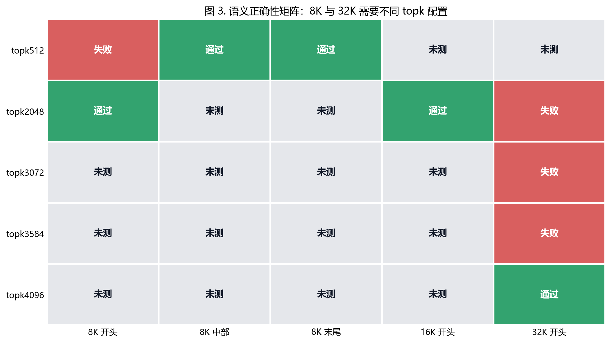

# Reproducing DeepSeek-V4-Flash on AMD ROCm with vLLM: 32K Correctness and TopK Sweep

This article summarizes an engineering reproduction of
`deepseek-ai/DeepSeek-V4-Flash` on an AMD ROCm ModelScope DSW instance. The work
focuses on a practical question: can a complex, fast-moving DeepSeek-V4-Flash
serving path be turned into a reproducible ROCm baseline with explicit
correctness gates?

The answer from this run is yes, with an important boundary: the current setup
is a fallback-heavy research baseline, not a production-grade high-throughput
serving result.

## Why this model

DeepSeek-V4-Flash is not a simple "download weights and start a server" model.
Its high-performance path depends on a combination of FP4/FP8 behavior,
FlashMLA, sparse MLA, MoE kernels, graph capture, and backend-specific kernel
coverage. On AMD ROCm, this makes the model a useful stress test for the
boundary between service-level compatibility and true model-path correctness.

The reproduction criteria were:

1. the vLLM OpenAI API server can start and `/v1/models` returns HTTP 200;
2. short prompts return stable, non-garbled answers;
3. long-context semantic retrieval works at 2K, 8K, and 32K;
4. the 8K `index_topk` performance/correctness tradeoff can be measured;
5. the scripts, data, and reports are small enough to preserve without storing
   model weights.

## Baseline setup

The main service configuration used:

```bash
python3 -m vllm.entrypoints.openai.api_server \
  --model "$MODEL_DIR" \
  --served-model-name deepseek-v4-flash-amd-32k-batch8-16384 \
  --host 0.0.0.0 \
  --port 8000 \
  --dtype auto \
  --trust-remote-code \
  --kv-cache-dtype fp8 \
  --block-size 256 \
  --tokenizer-mode deepseek_v4 \
  --tool-call-parser deepseek_v4 \
  --enable-auto-tool-choice \
  --reasoning-parser deepseek_v4 \
  --max-model-len 32768 \
  --max-num-seqs 8 \
  --max-num-batched-tokens 16384 \
  --gpu-memory-utilization 0.90 \
  --enforce-eager \
  --async-scheduling \
  --no-disable-hybrid-kv-cache-manager \
  --moe-backend triton \
  --disable-uvicorn-access-log
```

The run intentionally prioritized correctness and recovery. Several unstable
ROCm-specific paths were guarded or routed through ROCm/AITER/Triton/PyTorch
fallbacks before performance tuning.


## Correctness results

The main correctness gate was needle retrieval: insert a secret code into a long
context and ask the model to return only that code.

| Gate | Result |
|---|---:|
| Short completion | HTTP 200, `Paris`, 13.540s |
| 2K needle retrieval | PASS, 53.376s |
| 8K needle retrieval | PASS, 151.976s |
| 32K needle retrieval | PASS at `index_topk=4096`, 497.470s restart run |


The important lesson is that service startup is not enough. For long-context
models, semantic retrieval tests are a better gate than "the server is running".

## Top-k behavior

The `index_topk` value became a key correctness/performance knob. Lower values
can reduce candidate work, but they may also drop long-distance information.

| index_topk | 32K begin-position result | Latency |
|---:|---|---:|
| 2048 | FAIL, missing key fragment | 303.88s |
| 3072 | FAIL, incorrect token | 519.05s |
| 3584 | FAIL, incomplete token | 549.69s |
| 4096 | PASS | 572.91s |

For this run, `index_topk=4096` was the first verified 32K begin-position
correctness point.



## 8K sweep

For the 8K single-request probe, `index_topk=2048` was the best point measured:

| index_topk | 8K needle | TTFT | Effective prefill |
|---:|---|---:|---:|
| 4096 | PASS | 96.589s | 84.740 tok/s |
| 1024 | PASS | 95.217s | 85.962 tok/s |
| 1536 | PASS | 94.250s | 86.844 tok/s |
| 2048 | PASS | 80.313s | 101.914 tok/s |

Compared with the `index_topk=4096` baseline, the 2048 point improved TTFT by
about 16.9% and effective prefill by about 20.3%. However, it should not be used
as the 32K correctness setting because it failed the 32K begin-position needle
case.


## Negative result

Trying to raise `--max-num-batched-tokens` to 32768 failed during KV cache
planning:

```text
To serve max seq len 32768, 13.17 GiB KV cache is needed.
Available KV cache memory: 1.39 GiB.
Estimated maximum model length: 3448.
```

This was a useful negative result. It showed that long-context tuning cannot be
done by changing one scheduler parameter in isolation.

## Limitations

This run is not a direct comparison with high-end Nvidia serving benchmarks. The
workload here was a single-request AMD ROCm DSW probe, while public serving
benchmarks often use different GPU systems, different concurrency, and different
scripts. Public results are useful as optimization references, not as direct
apples-to-apples comparisons for this package.

## Next steps

The next high-value work is to move from fallback-heavy correctness to
ROCm-native performance:

- sparse MLA / sparse attention indexer profiling;
- ROCm-native top-k kernel experiments;
- mHC, qnorm, RoPE, KV fusion analysis;
- MoE and MXFP4/FP8 path validation;
- speculative decoding experiments once the baseline path is stable.

The repository intentionally keeps model weights out of version control. The
small artifacts that matter for reproducibility are scripts, patch notes, CSV
tables, figures, and environment reports.

