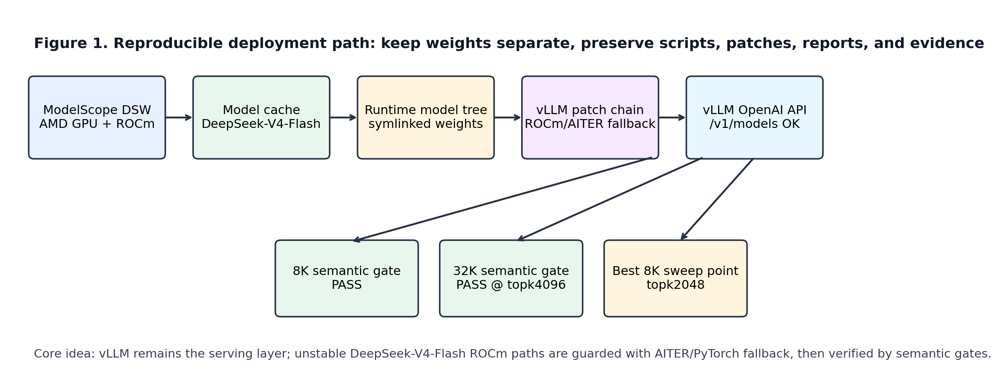
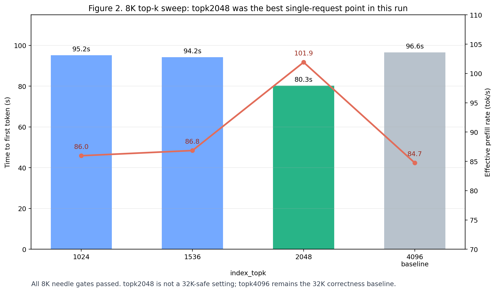
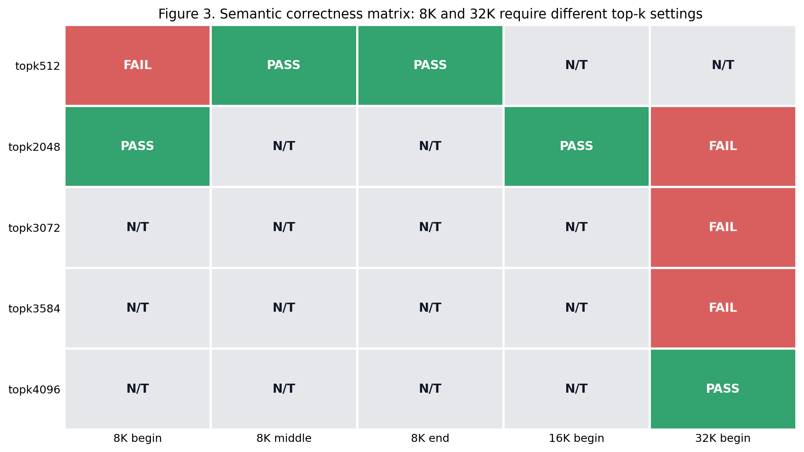
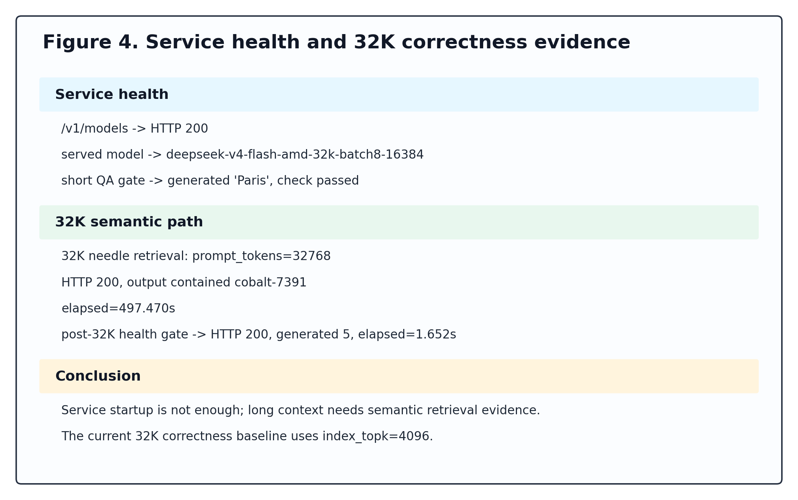
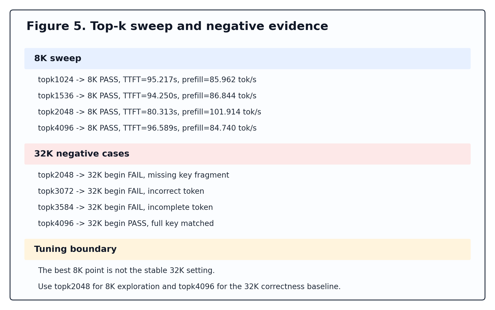

# Reproducing DeepSeek-V4-Flash on AMD ROCm with vLLM

[中文版本](zh.html)

Subtitle: 32K correctness, 8K `index_topk` sweep, and a fallback-heavy ROCm
research baseline.

This page is a public-facing summary of the reproducibility package. It is
written for GitHub Pages, so it keeps the narrative short and links back to the
repository reports for details.

## Summary

This project reproduces DeepSeek-V4-Flash serving on a ModelScope DSW AMD ROCm
instance through vLLM and fallback-safe ROCm/AITER/PyTorch paths. The project
does not claim upstream ROCm enablement. It preserves an engineering baseline
with scripts, notebook, data, figures, and reports.

Verified gates:

- OpenAI-compatible vLLM service health;
- short generation sanity check;
- 2K, 8K, and 32K semantic needle retrieval;
- 8K `index_topk` sweep;
- negative scheduler/KV cache finding.

## Results

| Result | Value |
|---|---:|
| 32K correctness top-k | `index_topk=4096` |
| 32K restart needle latency | 497.470s |
| Best 8K top-k | `index_topk=2048` |
| Best 8K TTFT | 80.313s |
| Best 8K effective prefill | 101.914 prompt tok/s |

## Figures

## Boundary

The baseline is useful for reproducibility and future ROCm kernel work. It is
not a production-grade serving result and should not be presented as an
apples-to-apples Nvidia comparison.

## Repository

See the repository README and reports for the full commands, scripts, data, and
evidence.
