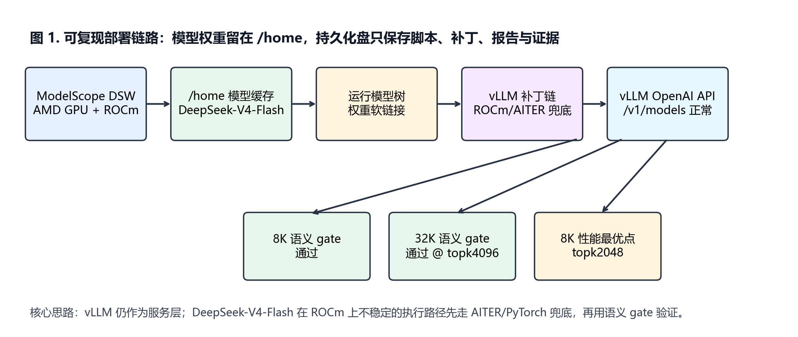
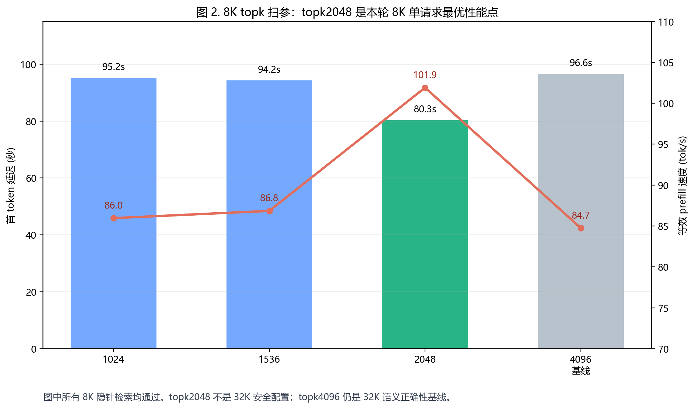
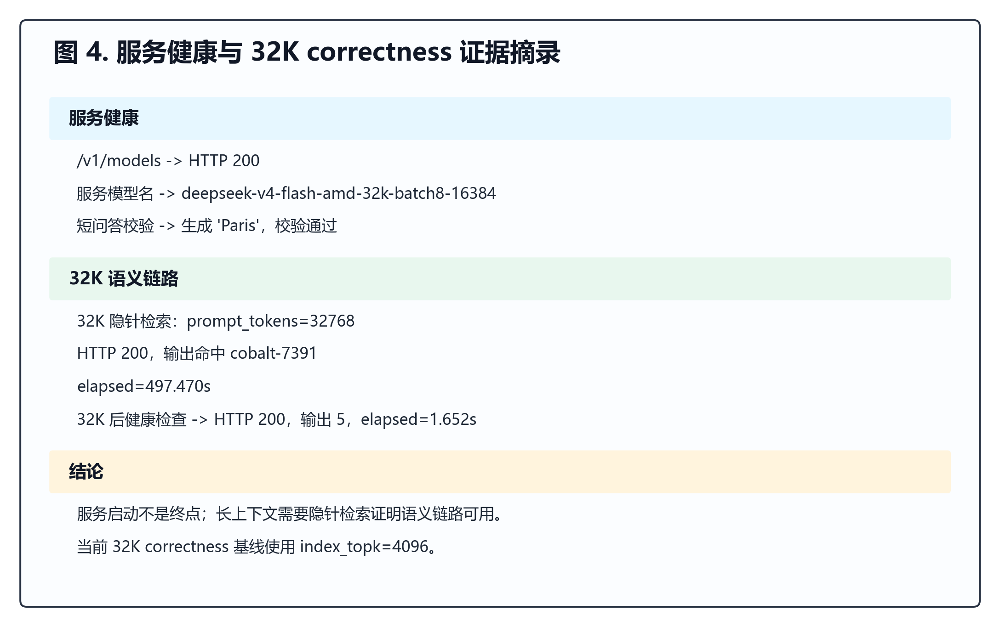
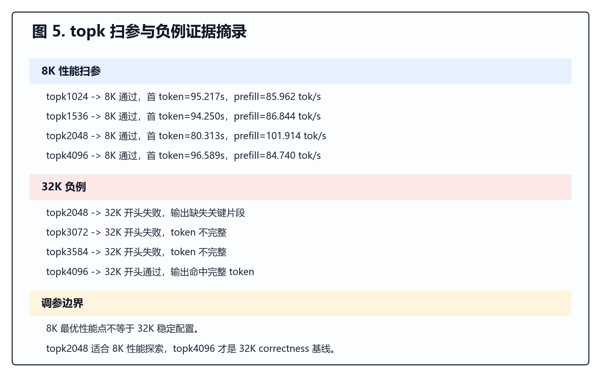

# 在 AMD ROCm 上复现 DeepSeek-V4-Flash vLLM 部署

副标题：32K correctness、8K `index_topk` 扫参，以及一条 fallback-heavy 的 ROCm 研究 baseline。

[English version](./)

## 摘要

这个项目记录了一次在 ModelScope DSW AMD GPU 环境中复现 DeepSeek-V4-Flash
vLLM 部署的工程实践。项目并不宣称实现了新的上游 ROCm 后端，而是把一次实际部署研究整理成可复查、可复跑、可继续做 kernel 优化的 baseline。

验证内容包括：

- OpenAI-compatible vLLM 服务健康检查；
- 短生成 sanity check；
- 2K、8K、32K semantic needle retrieval；
- 8K `index_topk` 性能扫参；
- scheduler / KV cache 负例分析。

## 关键结果

| 结果 | 数值 |
|---|---:|
| 32K correctness top-k | `index_topk=4096` |
| 32K 重启恢复后 needle latency | 497.470s |
| 8K 最优 top-k | `index_topk=2048` |
| 8K 最优 TTFT | 80.313s |
| 8K 最优等效 prefill | 101.914 prompt tok/s |

## 证据图

## 边界

当前结果是 correctness-first 的研究型部署，不是生产级高性能 serving
结果，也不应被表述为与公开高端 Nvidia serving 结果的同口径对比。

这条 baseline 的价值在于：它把 DeepSeek-V4-Flash 在 AMD ROCm 上的部署问题，拆解成了可复现的服务链路、语义正确性 gate、top-k 扫参和明确的 kernel 优化方向。

## 仓库

完整 Notebook、脚本、CSV 数据、图表和报告见 GitHub 仓库：

https://github.com/lyydfys/deepseek-v4-flash-rocm-vllm-repro
